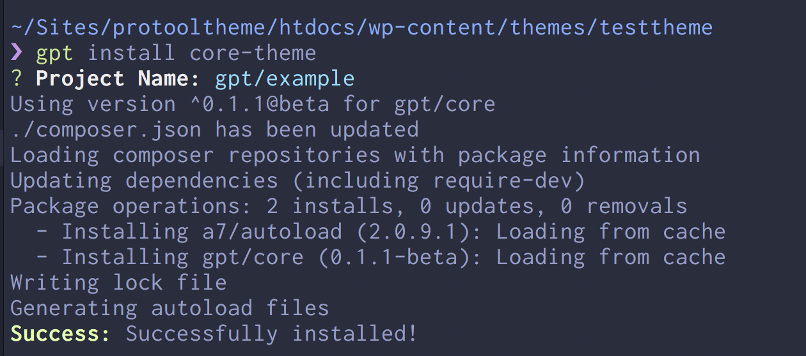
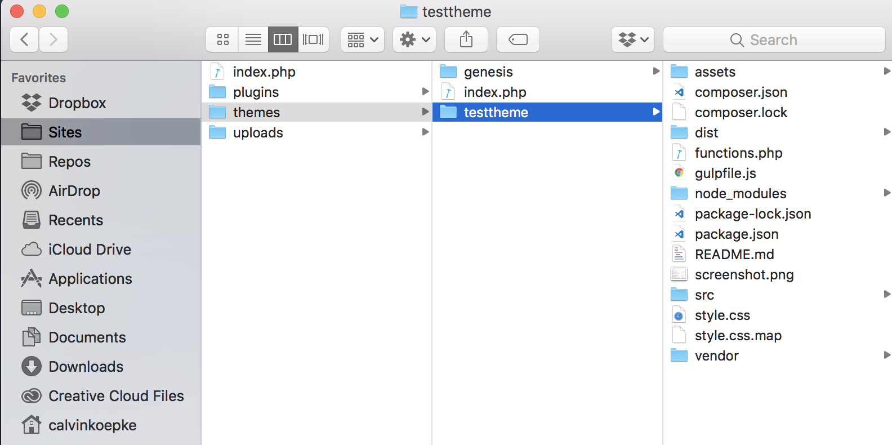

# Introduction
Genesis Pro Tools is a suite of developer tools and libraries, delivered as Composer packages, built specifically with the Genesis Framework in mind.

Some packages will likely work with other themes (such as JavaScript libraries and easy development functions), but support is only offered in the context of the Genesis Framework (must be on a paid plan).

There are both free and premium packages: the free packages are licensed under the standard GPL license used by WordPress. Premium
packages are proprietary and are only accessible with a valid `username` and `token`.

## Answering "Why?" 
The most important question to answer when adopting a new development workflow or framework is the question of "**why**":

Different developers often use as many different starter themes, as well as their own process for building exceptional client websites. While this is a reality
unlikely to change, streamlining these processes is still a goal to achieve.

Genesis Pro Tools aims to streamline the development process by enforcing 3 key principles:

1. Consistency across projects
2. Deployment friendliness
3. Modular composition

Having a suite of tools available that follow a similar pattern allows **predictability in a development workflow**, and thus provides **unique opportunities for automation.**

Diminishing repetitious tasks in favor of faster and more reliable startup-time has a direct impact on profit. As such, many of the packages that Genesis Pro Tools offers
are in the form of:
 
- Starter files (for both themes and plugins)
- Component libraries for re-usability
- Developer-facing features
- User-facing features

> Diminishing repetitious tasks in favor of faster and more reliable startup-time has a direct impact on profit.

## Requirements
Genesis Pro Tools requires some minimum dependencies for development, both of which are open-source and have their own documentations
available to the public. For convenience, we have added some basic instructions for installing these requirements on your machine.

Exhaustive instructions can be found at the linked documentation under each requirement.

### Composer
If you don't have Composer installed, you can easily install it via Homebrew:

```bash
brew install composer
```

For Windows (or if you don't have Homebrew on your Mac), see the [detailed docs](../requirements#composer).

### NodeJS
If you don't have NodeJS installed, you can easily install it via Homebrew:

```bash
brew install node
```

For Windows (or if you don't have Homebrew on your Mac), see the [detailed docs](../requirements#node).

### GPT-CLI
While it is not technically **required** in order to use Genesis Pro Tools packages (you could manually manage them via Composer commands), it makes things much easier. Furthermore, all documentation will be referencing it when possible.

The Genesis Pro Tools CLI is a tool that provides a simple interface for managing and installing Genesis Pro Tools packages. It unifies and automates
most of the manual work that would have to be done to create initial `composer.json` and `package.json` files, authentication for premium packages, and also includes helper commands
for common development tasks.

GPT-CLI is [open-source](https://github.com/cjkoepke/genesisprotools-cli) and can be contributed to as users of Genesis Pro Tools see fit and choose to contribute. Rules for contributing are yet to be created, so stay tuned.

To install GPT-CLI, run:

```bash
npm i gpt-cli -g
```

## Setup a New Theme
The first step in any new Genesis project is usually to set up a new theme. Normally, this would entail copying/pasting your starter theme to
a new theme folder in the `/wp-content/themes` directory, and then manually going through and updating all the information to reflect the new project.

With the Genesis Pro Tools Theme Package, initial setup is a breeze.

### Authenticate
If you haven't already, you'll want to authenticate your account to gain access to packages. In terminal:

```bash
gpt config
```

When prompted, enter your `username` and `token`.

### Install Core
Navigate to your theme directory via a terminal of your choice. In this example, our theme will be called `gpt`. So, if your theme folder was located in
a directory like `Sites/example/wp-content/themes`, you would type this and then hit `Enter`:

```bash
cd Sites/example/wp-content/themes/gpt
``` 

Next, we setup the Theme Core module:

```bash
gpt install core-theme
```

GPT-CLI will then ask you for your project name. This is a required definition in your `composer.json` file. It can be anything you
wish, but should follow the pattern `vendor/name`, or you'll get warnings in the console.

For our install, we choose `gpt/example`, and hit **Enter**. The CLI will then generate your `composer.json` file for you, and require the
appropriate module. You should see an output similar to this (may differ in style and version numbers):



And a directory structure that looks like this:


This is really nice, but not very useful to get off the ground quickly with developing. It's not even a valid theme yet. So let's fix that
by installing Uno, our starter theme that's built specifically for this setup.

### Install Uno
From the same directory, run the following command:

```bash
gpt theme start
```

This will prompt you with two questions:

```
? Theme Slug: (uno)
? Theme Name: (Uno)
```

1. **Theme Slug** is used to generate your `package.json` file, as well as do a search/replace for instances of `uno` in the starter theme files.
2. **Theme Name** is used to generate your `package.json` file, as well as set the theme name properly in the `style.css` file.

After submitting a string to the **Theme Name** parameter, the CLI will run the following commands in order:

1. Copy over Uno starter theme files to the current working directory.
2. Install Node Modules from the `package.json` file.
3. Run the initial build command to compile assets to the `/dist` directory, such as:
	- CSS
	- JS
	- Images
	- POT Files for translation
	
This process takes a bit of time, and you'll see a lot of output in the terminal. The main thing you're looking for is the final success message
once it's done:

```
Success: Uno starter files successfully generated!
```

You can verify the installation by checking your theme directory. It should look like this:



### Next Steps
You're done! You now have your starter theme installed and all the Core functionality of Genesis Pro Tools hooked up and ready to go. Every new
theme project is just rinse/repeat, using this same method.
 
The development workflow of Uno is a bit different than what you might be used to, so here are some recommended steps for further learning:

- Core Documentation (Coming soon!)
- Uno Documentation (Coming soon!)
